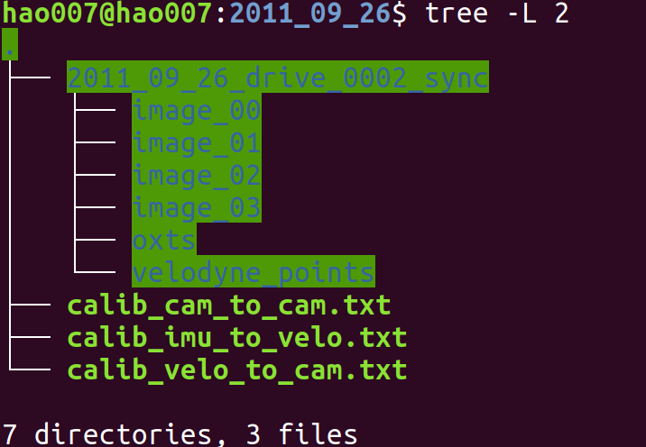
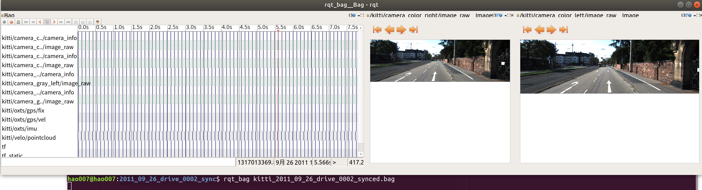
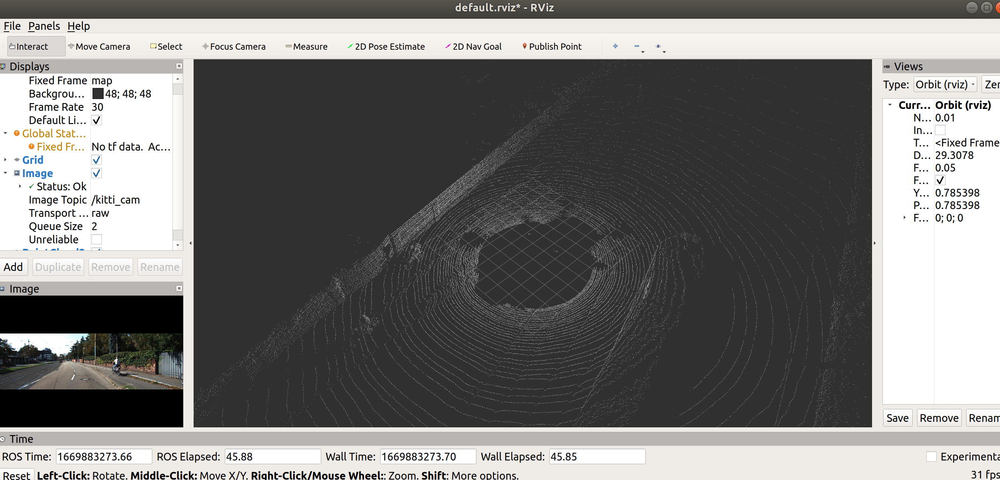
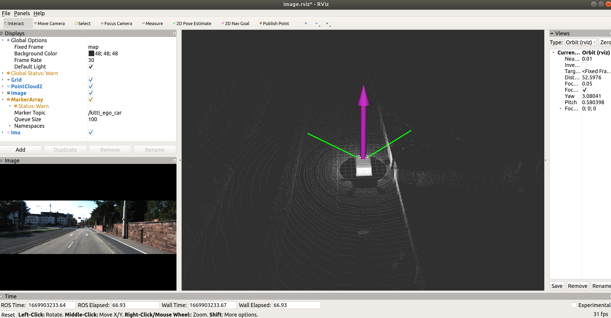

<!--

 * @Author: zhanghao
 * @Date: 2022-12-01 13:19:07
 * @LastEditTime: 2022-12-18 17:58:28
 * @FilePath: /hao_auto_drive/README.md
 * @Description: 
-->
# hao_auto_drive
参考youtube自动驾驶系列视频
## 00 2022-12-18 push & delete
## 01 介绍KITTI数据集
见 https://github.com/haohaoalt/hao_datasets
传感器：
相机： 左边彩色+黑白  右边彩色+黑白
3D激光雷达：360度激光雷达（黑色东西反射率较低可能会导致距离不准确）


使用kitti2bag将kitti数据集转化为rosbag格式

使用方法：https://github.com/haohaoalt/hao_kitti2bag

安装：

```
sudo pip install kitti2bag
```



将标定的txt文件复制到如上目录中，执行（2011_09_26可更换 0002可更换）

```
 kitti2bag -t 2011_09_26 -r 0002 raw_synced .
```

```
rqt_bag kitti_2011_09_26_drive_0002_synced.bag    //简单查看bag包的内容
```



## 02 发布照片

```
roscore
```

```
cd catkin_ws
catkin_make
source devel/setup.bash
rosrun kitti_tutorial kitti.py
```

使用pipi安装opencv时注意

```shell
pip install opencv-python 
会报错 原因：opencv-python-4.3.0.38 不再支持 Python 2.7，用pip install opencv-python命令可能自动安装最新版本的opencv-python，所以把 opencv-python 的版本降级到能支持Python 2.7的最新版本就可以了。
pip install opencv-python==4.2.0.32 -i https://pypi.tuna.tsinghua.edu.cn/simple
```


```python
  # 重要的地方
  cam_pub = rospy.Publisher('kitti_cam',  Image, queue_size=10)
  img = cv2.imread(os.path.join(DATA_PATH, 'image_02/data/%010d.png'%frame)) 
  cam_pub.publish(bridge.cv2_to_imgmsg(img, "bgr8"))
```

## 03 发布点云

```python
pcl_pub = rospy.Publisher('kitti_point_cloud', PointCloud2, queue_size=10)
point_cloud = np.fromfile(os.path.join(DATA_PATH, 'velodyne_points/data/%010d.bin'%frame), dtype=np.float32).reshape(-1,4)
header = Header()
header.stamp = rospy.Time.now()
header.frame_id = 'map'
pcl_pub.publish(pcl2.create_cloud_xyz32(header, point_cloud[:,  :3]))
```



## 04 加载marker及markerarray


## 05 发布IMU数据




## 06 发布GPS消息

